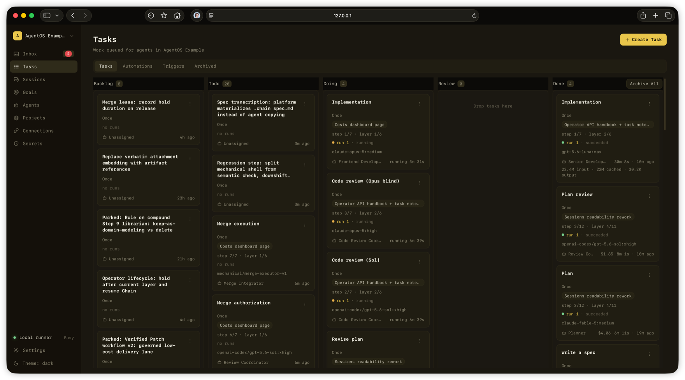
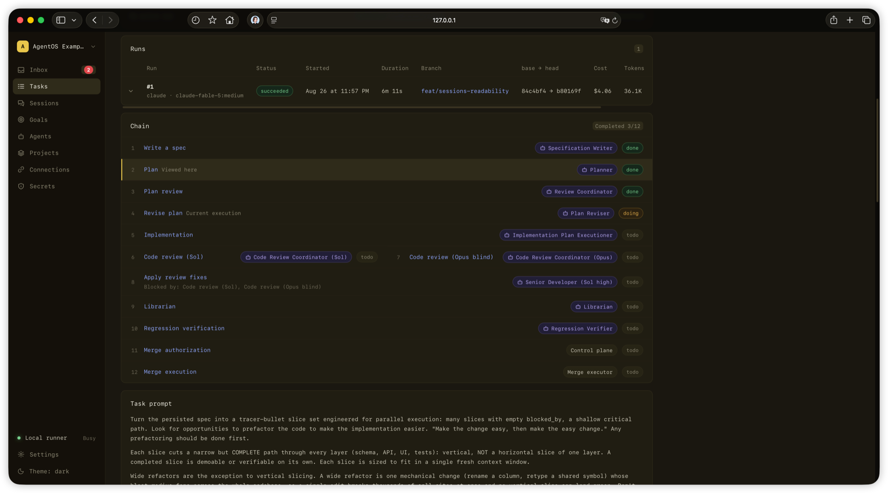

# AgentOS

[简体中文](README.zh-CN.md)

> **AgentOS v0.2.0 — Developer Preview 2.** This is an early preview. Interfaces,
> configuration and stored data shapes may change between preview releases, and
> there is no upgrade path between them other than a fresh install. Read
> [`docs/release/v0.2.0-release-notes.md`](docs/release/v0.2.0-release-notes.md)
> before installing, and
> [`docs/release/v0.1.0-support-matrix.md`](docs/release/v0.1.0-support-matrix.md)
> for what is supported and on what evidence.

> **Host-execution warning.** AgentOS launches coding CLIs with non-interactive
> permission bypass. In the default installation they run as your macOS user,
> outside an application sandbox, with that user's filesystem and network
> authority. AgentOS grants constrain AgentOS APIs; they are not host
> containment. Use only a disposable repository and a machine/account you are
> willing to let an agent modify.

AgentOS is a local, single-operator control plane for assigning scoped software
tasks to coding agents and keeping the work observable and durable. It connects
tasks, agents, repository and file grants, isolated run records, provider event
streams, human questions, review gates, and git delivery in one workflow.

AgentOS orchestrates the official Codex CLI and Claude Code installed and
authenticated on the user's Mac, bundles or resells no subscription, and
provider terms and plan limits apply.

An independent build inspired by Danny Postma's video 'How I Built My Own
AgentOS on Claude's Agent SDK (So You Can Too)' (2026) — built from scratch
from the ideas in the video.





## Release-candidate evidence status

The labels below describe the evidence recorded in this repository; they are
not compatibility promises by the CLI providers.

- **Verified**: exercised runtime or repository evidence exists for the stated
  path.
- **Maintainer-verified**: a maintainer exercised the stated path on the named
  platform, but the clean-machine reproduction gate is still open.
- **Experimental**: implemented enough for development evaluation, without a
  v0.1 support commitment.
- **Pending**: required evidence has not been completed. Do not infer support.
- **Unverified**: no qualifying evidence has been recorded.
- **Unsupported**: outside the supported target.

### Provider support

| Provider runtime | Status | Evidence boundary |
| --- | --- | --- |
| Codex CLI | **Verified** | Adapter/runtime and subscription authentication path are verified. Clean fresh-install evidence is **Pending (OSS-B)**. |
| Claude Code | **Verified** / **Maintainer-verified** | Adapter/runtime is verified. Claude Pro/Max authentication is maintainer-verified on macOS Apple Silicon. The v0.1 clean-install gate is **Pending (OSS-B)**. |
| Pi | **Experimental** | Adapter code exists, but Pi is not part of the committed v0.1 support surface. |

Provider CLIs, accounts, authentication, subscriptions, usage allowances, rate
limits, models, and provider-side availability remain the user's responsibility.
AgentOS does not supply provider credentials or entitlement.

### Platform support

| Platform | Status | Evidence boundary |
| --- | --- | --- |
| macOS on Apple Silicon | **Target platform** | Current maintainer evidence includes Claude Pro/Max authentication; the complete clean fresh-install gate remains **Pending (OSS-B)**. |
| Linux | **Unverified** | Do not infer support from the Node.js codebase. |
| Windows | **Unsupported** | The current runner relies on POSIX process-group, path, and command behavior. |

### Feature surface

| Feature | Status | Evidence boundary |
| --- | --- | --- |
| Goals | **Pending** | The control plane stores a Goal, its Definition of Done, its progress log, and its limits, and the console edits them. No execution model is wired: nothing schedules work from a Goal, nothing measures its spend, and nothing stops it on spend, time, or stall. The console therefore renders no spend figure and no stopped state, because the server has no writer for either. |

## Start locally

The Developer Preview targets one platform: an Apple Silicon Mac. For this
release, use Node.js `22.17.0` from `.nvmrc`. Installation enforces Node.js satisfying `^20.19.0 || ^22.13.0 || >=24`,
the range shared by the locked toolchain; Node 22.12.x and 23 are refused. You
also need

- npm 10.9.2 or newer;
- Docker with Docker Compose, for the PostgreSQL service defined here;
- Git;
- the official **Codex CLI, already installed and already signed in**, under the
  same macOS account that will run the AgentOS runner;
- optionally, the GitHub CLI (`gh`), installed and authenticated under that
  account, if AgentOS should open pull requests automatically.

Codex is the only provider CLI this preview requires. The starter agent it
installs runs on Codex; Claude Code and the experimental Pi adapter are optional,
and a machine without them is a complete installation. AgentOS never logs you
into a provider and never reads a credential store.

```sh
git clone https://github.com/mosonlab/agentos.git
cd agentos
git checkout v0.2.0
npm ci
npm run setup:local
npm run build
docker compose up -d --wait --wait-timeout 60 postgres
export GOAL5A0_MASTER_SHA=8d69ee8544196a3310b3d63caf8ce5ec9a0e023b
export GOAL5A0_CONTROL_PLANE_A_SHA=29f8dd354cb99d671c2e2e4e9e23716fd8004f3d
npm run db:migrate:release -- --fresh
```

This is the release installation path, not a contributor bootstrap. Follow the
corrected, literal sequence in
[`docs/release/v0.1.0-developer-preview.md`](docs/release/v0.1.0-developer-preview.md),
including its filesystem, port, runner identity and repository preflights. Then
start `npm run dev:api`, `npm run dev:runner` and `npm run dev:web`, in that
order, in three terminals, and open `http://127.0.0.1:5173`.

`npm ci` must be allowed to run the lockfile's lifecycle scripts — this
repository's `postinstall` generates the Prisma client — so `--ignore-scripts`
is not supported. The Inbox service is optional. No launchd definition is
shipped for the foreground Developer Preview sequence; remote access and this
repository's internal task-chain templates are also outside that sequence. A
self-hosted merge executor instead has supported macOS LaunchDaemon and Linux
systemd profiles in the public
[`docs/runbooks/merge-executor.md`](docs/runbooks/merge-executor.md) runbook.

Read [`docs/release/v0.1.0-security.md`](docs/release/v0.1.0-security.md)
before pointing this at anything, and
[`docs/release/v0.1.0-migration-and-recovery.md`](docs/release/v0.1.0-migration-and-recovery.md)
before putting data in it.

`npm run db:migrate` is `prisma migrate dev`, and it is **development only**. It
is documented in `CONTRIBUTING.md`, not as an installation command. The guarded
release path above runs `npm run db:migrate:release -- --fresh`, which takes an
exclusive maintenance lock before it inspects schema state and holds it through
the guarded migration. An export without a valid `release-authority.json`
attestation stops rather than defaulting to trusted. `--existing` separately
implements the verified-bundle consumer, but this repository does not ship the
backup producer needed to create a conforming bundle. The supported release
workflow therefore remains fresh-only; `--existing` does not emit a synthetic
"interface unavailable" refusal and must not be treated as an end-to-end
supported migration path. The exact implemented sequence and refusal conditions
are in the release quickstart and migration guide. Packaging, notarization and
auto-update are not in this release candidate.

`npm run setup:local` writes `.env` once, at mode 0600, with distinct random
operator and runner tokens, a session-cookie secret, a base64 32-byte encryption
key, and one database password written identically into `POSTGRES_PASSWORD` and
`DATABASE_URL`. It prints a class and never a value. Its `--upgrade` form
preserves every assignment and adds only missing safe-to-generate keys; it never
rotates weak credentials automatically. There is no overwrite or rotation flag.
`.env.example` documents the keys; it is not a file to copy.

To provision the fail-closed merge executor, first read its
[operator runbook](docs/runbooks/merge-executor.md), then run the repeatable
human-owned capture wizard from the repository root:

```sh
bash scripts/setup-merge-executor.sh
```

The wizard registers no App and performs no administrator action itself. It
captures the installation-local private GitHub App configuration, validates the
dedicated OS-user/key boundary without reading key bytes, and leaves explicit
root-owned service adoption to the matching runbook profile.

## Architecture grounded in the current code

```text
Web console / phase-0 CLI
          |
          v
Control-plane API  <---->  PostgreSQL
          ^                    tasks, runs, leases,
          |                    events, grants, outputs
          |
Local runner -----> ephemeral git workspace
          |
          +----> Codex CLI / Claude Code / experimental Pi adapter
                         |
                         +----> AgentOS session tools (MCP or Pi extension)
```

- The React/Vite web console and Hono API expose projects, agents, capabilities,
  tasks, chains, approvals, runs, sessions, and the Inbox workflow.
- PostgreSQL, accessed through Prisma, stores task state separately from durable
  Run and SessionEvent records.
- The local runner claims work with a fenced lease, clones the selected
  repository into a controlled per-run workspace, creates or resumes the run
  branch, preflights the selected CLI, and records structured provider events.
- Codex and Claude receive the AgentOS session tools over a per-run stdio MCP
  server. Pi receives the corresponding task tools through an extension.
- The repository CLI currently exposes only `agentos help`; broader CLI command
  families are not claimed by this release candidate.

## A real task workflow

1. The operator creates a project, registers a repository, defines an agent,
   and grants the repository access, Files Root access, and secrets needed by
   the current runtime. Skill, custom-MCP, and collaborator bindings can also
   be stored as control-plane configuration, but they are not currently sent to
   the runner as runtime grants.
2. The operator creates a task directly or from a task-chain template and
   selects Codex, Claude, or the experimental Pi path.
3. The runner claims the queued Run with a lease and fencing generation, then
   provisions an ephemeral clone and a run-specific git branch.
4. Provider preflight checks the configured binary, version command, and login
   status before the agent starts.
5. The agent works in the clone, streams provider and tool events, logs notable
   progress, can ask a blocking human question through the Inbox, and persists
   its task output.
6. AgentOS captures the git result and pushes the run branch. A repository-access
   row is required when the task is created and claimed, but its read/write
   level does not currently gate that push. The Run's `opensPullRequest` setting
   controls whether delivery also attempts to open a pull request. A gated task
   moves to review for a human decision; an ungated successful task can finish.

> **Pending (OSS-C): public demo evidence.** The screenshots above illustrate
> the interface only. No video, timing, benchmark, or end-to-end demo claim is
> part of this README until the OSS-C evidence gate is complete.

## Security defaults and limits

- Operator, runner, and per-run session principals are separate. Runner routes
  and session routes are scoped independently, and session tokens expire or are
  revoked with the Run.
- Runner-authenticated run-state writes and the session event, activity, output,
  Inbox, and completion paths are checked against the Run's fencing generation;
  stale or expired generations are rejected, and the runner terminates the
  provider process group. Files Root mutations instead require a lease-bound
  per-run session token and matching Filesystem Grant; their requests carry no
  client fencing field.
- Child processes receive an explicit environment containing configured
  `PATH`/`HOME`, Run identity, session credentials, and granted secrets; the
  runner does not copy the host environment wholesale.
- Runner proxying is opt-in through `RUNNER_HTTP_PROXY`, `RUNNER_HTTPS_PROXY`,
  and `RUNNER_NO_PROXY`. When configured, it applies to the whole
  runner-controlled network path: Claude, Codex, the experimental Pi adapter,
  and Git/workspace provisioning and delivery commands. Conventional host proxy
  variables are ignored. A `RUNNER_RUN_AS_PREFIX` launcher must preserve the
  explicit environment; proxy URLs are not serialized into provider argv.
- Stored secrets use AES-256-GCM. Plaintext and ciphertext are excluded from the
  public API's secret representations.
- The control plane requires a repository-access row and checks Files Root
  grants. The repository access row's read/write level does not currently gate
  delivery push. Per-run credentials are written mode `0600` inside the
  throwaway workspace and excluded from git locally.
- Successful workspaces are removed. A bounded number of failed workspaces may
  be retained for recovery according to runner configuration.
- Exactly one API control plane may own a canonical workspace root. Ownership is
  acquired from the protected, API-only `CONTROL_PLANE_STATE_DIR` before Prisma
  is imported or reconciliation begins. Runner daemons remain ordinary clients,
  and any number of them may poll that one API.
- The public snapshot is closed by default and scanned for unclassified paths,
  credentials, PII, private absolute paths, and internal-only material.

Important limitation: the current provider adapters use non-interactive
permission-bypass flags. AgentOS grants constrain its control-plane APIs, but
they are not by themselves an OS sandbox. With the shipped same-user default,
Filesystem Grants are an authorization and audit boundary rather than a host
filesystem containment boundary. This release candidate does not claim enforced
network isolation. Use a dedicated, minimally privileged runner account when
stronger host separation is required, and review the warning comments in
`.env.example` before enabling `RUNNER_RUN_AS_PREFIX` — that prefix separates
the *runners* from each other, and one runner's account still owns every
workspace it has ever created, so it can delete its own earlier ones. The Files
path walk also carries a known open gap against an adversary who can already
write inside the Files Root.

[`docs/release/v0.1.0-security.md`](docs/release/v0.1.0-security.md) states each
of these limits and what is and is not checked; read it before pointing this at
anything you care about.

## Templates release demo

`npm run demo:templates -- preflight|setup|instantiate|capture|verify|reset`
drives the guarded evidence workflow for the canonical twelve-step template. The
current contract and exact commands are in
[`docs/demos/templates-release-demo.md`](docs/demos/templates-release-demo.md).
It proves one serial execution at named AgentOS and target SHAs. OSS-B separately
authorizes any fresh-install claim, and CP-A separately authorizes the named
provider path; a rehearsal or one provider run proves neither universal provider
compatibility nor a fresh install.

## Verification

The repository defines these checks, in this order:

```sh
npm run db:validate
npm run typecheck
npm run lint
npm run build
npm test
npm run agentos -- help
docker compose config --quiet
npm run test:dependency-gate
npm run test:snapshot-scan
npm run snapshot:scan
```

`npm test` runs every workspace's unit tests and needs no database and no
running service. It does need `npm run build` to have run first: the web CSS
regression test reads the built stylesheet out of `apps/web/dist/`, and without
it that one file fails with `Build apps/web before running CSS regression
tests`.

`npm run test:db` is separate on purpose and is **not** part of `npm test`. It
runs the API's database tests against a live PostgreSQL that the caller
supplies, through `TEST_DATABASE_URL` and `TEST_DATABASE_MAINTENANCE_URL`,
against a scratch database — never a database holding anything you want to keep.
Folding it into `npm test` would make the default check for a fresh clone fail
for a missing service rather than for a defect.

Those tests run several files at once, each against a database of its own: the
runner migrates one template and hands every file a `CREATE DATABASE ...
TEMPLATE` copy of it, plus its own subdirectory of `RUNNER_WORKSPACE_ROOT`,
`CONTROL_PLANE_STATE_DIR` and `FILES_ROOT`. The one shared schema is what used to
force the files into a queue, and separate databases also separate what a schema
never could — advisory locks are per database. Handing out databases needs
`AGENTOS_ALLOW_SCRATCH_DATABASES=1`, the opt-in the scratch-database manager
already requires; without it the run stays serial on the single shared schema,
exactly as before. `AGENTOS_DBTEST_CONCURRENCY` sets how many files run at once
(default: cores-1, at most four — a test file is not one process, and past four
of them a laptop is oversubscribed rather than busy) and
`AGENTOS_DBTEST_PROVISION=0` turns the per-file databases off. Every exit drops
what it created: a failure, a Ctrl-C, a failure while the databases are still
being handed out. A run that cannot drop one says so and fails, rather than
reporting the green tests it also had. Only a run killed outright can leave
`agentos_cp_a_*` databases behind, and the next run reclaims those before it
starts — by name, and only where the process that created it is gone and nothing
is connected to it.

`npm run test:dependency-gate` is in that list because root `npm test` is
`npm run test --workspaces --if-present` and never reaches `scripts/`. Without
this line the published `scripts/goal-5a0-*` files would ship with no executed
proof — the snapshot scan proves they are *listed*, not that they still refuse a
filesystem-root, checkout, non-empty, symlinked, or non-allowlisted evidence
destination. It needs no `node_modules` and no database.

`npm run snapshot:scan` reads the tracked worktree and requires it to match
`HEAD`; it fails closed on a dirty tree rather than attributing the change to
the reported commit.

The snapshot commands are documented in
[`docs/public-snapshot.md`](docs/public-snapshot.md). A green scan is a scoped
release gate, not proof that pattern matching can find every possible secret.

`npm run lint` is a deliberately small gate, and `scripts/merge-gate.sh` runs it:
Biome checks an opt-in list of safety rules (`biome.jsonc`, each entry carrying
the reason it is there), and typescript-eslint checks the single type-aware rule
`no-floating-promises`, plus the one syntactic selector that closes that rule's
unavoidable `node:test` blind spot (`eslint.config.mjs`). It does not check
formatting, and running it never rewrites a file.

## Contributing and license

Public contribution guidance and the final release wording remain gated by
OSS-B, OSS-C, and OSS-F.

This snapshot is licensed under the [MIT License](LICENSE). The snapshot
boundary and exclusions are defined by
[`public-snapshot.json`](public-snapshot.json).
