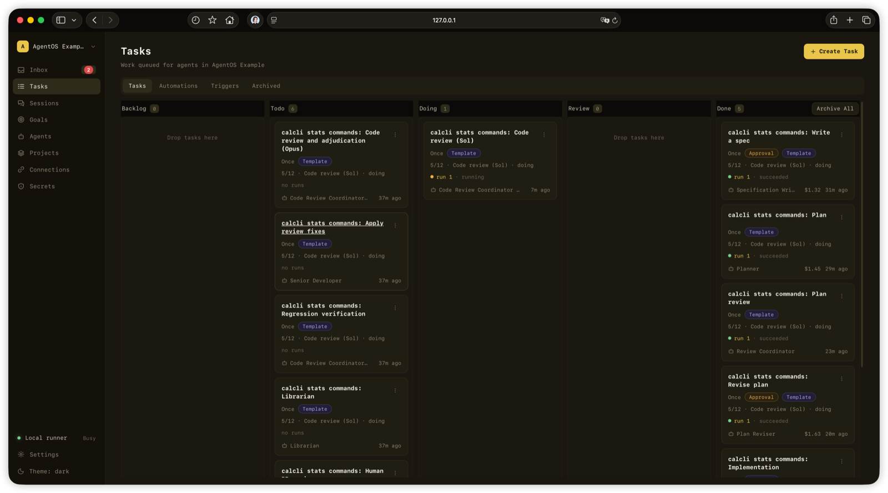

# AgentOS

[English](README.md)

> **AgentOS v0.1.0 — Developer Preview（开发者预览）。** 这是一个早期预览版：
> 接口、配置与已存数据的形状都可能在预览版之间发生变动，且预览版之间除了全新
> 安装以外没有升级路径。安装前请先读
> [`docs/release/v0.1.0-release-notes.md`](docs/release/v0.1.0-release-notes.md)；
> 支持范围与各自的证据边界见
> [`docs/release/v0.1.0-support-matrix.md`](docs/release/v0.1.0-support-matrix.md)。

> **裸机执行警告。** AgentOS 会用非交互式 permission bypass 启动 coding CLI。
> 默认安装下，CLI 以你的 macOS 用户身份、在 application sandbox 之外运行，拥有该
> 用户的文件系统与网络权限。AgentOS grant 约束的是 AgentOS API，不构成 host
> containment。只应使用可丢弃仓库，以及你愿意让 agent 修改的机器和账号。

AgentOS 是面向单一操作者的本地控制平面，用于把有明确权限范围的软件任务交给
编码 agent，并让工作过程可观察、结果可持久化。它把任务、agent、仓库与文件
授权、独立的运行记录、provider 事件流、人工提问、评审关卡和 git 交付串成一个
工作流。

AgentOS 编排安装在用户 Mac 上且已完成认证的官方 Codex CLI 和 Claude Code；
AgentOS 不捆绑或转售任何订阅，provider 条款和套餐限制仍然适用。

本项目是受 Danny Postma 的视频 'How I Built My Own AgentOS on Claude's Agent
SDK (So You Can Too)'（2026）启发的独立实现，从视频中的想法出发从零构建。




## 发布候选证据状态

以下标签描述本仓库内记录的证据，不是 CLI provider 作出的兼容性承诺。

- **已验证（Verified）**：所述路径已有实际运行或仓库证据。
- **维护者已验证（Maintainer-verified）**：维护者已在指定平台实际运行，但全新
  机器复现关卡仍未完成。
- **实验性（Experimental）**：实现程度足够用于开发评估，但不构成 v0.1 支持
  承诺。
- **待完成（Pending）**：所需证据尚未完成，不应据此推断已支持。
- **未验证（Unverified）**：尚无符合要求的证据记录。
- **不支持（Unsupported）**：不在支持目标内。

### Provider 支持

| Provider 运行时 | 状态 | 证据边界 |
| --- | --- | --- |
| Codex CLI | **已验证** | adapter/runtime 和订阅认证路径已验证；全新安装证据为 **待完成（OSS-B）**。 |
| Claude Code | **已验证** / **维护者已验证** | adapter/runtime 已验证；Claude Pro/Max 认证已由维护者在 macOS Apple Silicon 上验证；v0.1 全新安装关卡为 **待完成（OSS-B）**。 |
| Pi | **实验性** | adapter 代码已存在，但 Pi 不属于已承诺的 v0.1 支持范围。 |

Provider CLI、账号、认证、订阅、用量、速率限制、模型和 provider 侧可用性均由
用户负责。AgentOS 不提供 provider 凭据或使用资格。

### 平台支持

| 平台 | 状态 | 证据边界 |
| --- | --- | --- |
| Apple Silicon 上的 macOS | **目标平台** | 当前维护者证据包括 Claude Pro/Max 认证；完整的全新安装关卡仍为 **待完成（OSS-B）**。 |
| Linux | **未验证** | 不应因为项目使用 Node.js 就推断已支持。 |
| Windows | **不支持** | 当前 runner 依赖 POSIX 进程组、路径和命令行为。 |

### 能力支持

| 能力 | 状态 | 证据边界 |
| --- | --- | --- |
| Goals | **待完成** | 控制平面存储 Goal 及其 Definition of Done、进展日志和各项上限，控制台可以编辑它们。执行模型未接线：没有任何东西从 Goal 派发工作，没有任何东西统计它的花费，也没有任何东西按花费、时间或停滞把它停下。因此控制台不渲染花费数字，也不渲染已停止状态——服务端对这两者都没有写入方。 |

## 本地启动

Developer Preview 只面向一个平台：Apple Silicon Mac。本版本应使用 `.nvmrc`
记录的 Node.js `22.17.0`。安装会强制要求 Node.js 满足 `^20.19.0 || ^22.13.0 || >=24`，
即锁定工具链共同支持的范围；Node 22.12.x 与 23 会被拒绝。此外还需要

- npm 10.9.2 或更高；
- Docker 与 Docker Compose，用于仓库内定义的 PostgreSQL 服务；
- Git；
- **已安装且已登录**的官方 Codex CLI，位于将要运行 AgentOS runner 的同一个 macOS
  账号下；
- 如果希望 AgentOS 自动创建 pull request，还需在同一账号下安装并认证 GitHub CLI
  (`gh`)；只交付 branch 时不需要它。

本预览只要求 Codex 这一个 provider CLI：它安装的 starter agent 跑在 Codex 上；
Claude Code 与实验性的 Pi adapter 都是可选的，没装它们的机器同样是一份完整安装。
AgentOS 从不替你登录 provider，也从不读取任何凭据存储。

```sh
git clone https://github.com/mosonlab/agentos.git
cd agentos
git checkout v0.1.0
npm ci
npm run setup:local
npm run build
docker compose up -d --wait --wait-timeout 60 postgres
export GOAL5A0_MASTER_SHA=485fb118db96e3977006a2edc866a38b751ff0e2
export GOAL5A0_CONTROL_PLANE_A_SHA=c671439831b075568420b92f4494227fa7fc392b
npm run db:migrate:release -- --fresh
```

这是发布安装路径，不是 contributor bootstrap。请逐字执行已更正的
[`docs/release/v0.1.0-developer-preview.md`](docs/release/v0.1.0-developer-preview.md)，
包括文件系统、端口、runner identity 与仓库 preflight。然后在三个终端里依次启动
`npm run dev:api`、`npm run dev:runner`、`npm run dev:web`，并打开
`http://127.0.0.1:5173`。

`npm ci` 必须被允许运行 lockfile 声明的生命周期脚本——本仓库的 `postinstall` 生成
Prisma client——因此**不支持 `--ignore-scripts`**。Inbox 服务可选。v0.1.0 不交付、
也不支持任何 launchd 定义；远程访问和本仓库内部 task-chain 模板同样不属于受支持
流程。

在把它指向任何东西之前先读
[`docs/release/v0.1.0-security.md`](docs/release/v0.1.0-security.md)，在往里放数据
之前先读
[`docs/release/v0.1.0-migration-and-recovery.md`](docs/release/v0.1.0-migration-and-recovery.md)。

`npm run db:migrate` 就是 `prisma migrate dev`，**只用于开发**；它只在
`CONTRIBUTING.md` 中作为开发命令说明，不是安装命令。上面的有闸发布路径运行
`npm run db:migrate:release -- --fresh`。该命令在读取 schema 状态前取得排他维护锁，
并在有闸迁移全程持有它。没有有效 `release-authority.json` attestation 的导出会停下，
不会默认为可信。`--existing` 已实现 verified-bundle consumer，但本仓库不交付用于生成
合规 bundle 的 backup producer。因此受支持的发布流程仍只有 fresh；`--existing` 不会
发出虚构的 “interface unavailable” refusal，也不能被视为受支持的端到端迁移路径。实际
实现的完整流程与拒绝条件见发布 quickstart 和迁移指南。打包、公证与自动更新同样不属于
本发布候选范围。

`npm run setup:local` 会一次性生成权限 0600 的 `.env`：互不相同的 operator 与 runner
token、session cookie secret、base64 编码的 32 字节加密密钥，以及同时写入
`POSTGRES_PASSWORD` 与 `DATABASE_URL` 的同一个数据库口令。它只输出状态类别，从不
输出任何值。`--upgrade` 会保留所有已有 assignment，只补可在本机安全生成的缺键，且
不会自动轮换弱凭据；它没有 overwrite 或 rotation 开关。`.env.example` 只是键位说明
文档，不是用来复制的文件。

## 以当前代码为依据的架构

```text
Web 控制台 / phase-0 CLI
          |
          v
控制平面 API  <---->  PostgreSQL
          ^                 任务、运行、租约、
          |                 事件、授权、输出
          |
本地 runner -----> 临时 git 工作区
          |
          +----> Codex CLI / Claude Code / 实验性 Pi adapter
                         |
                         +----> AgentOS session 工具（MCP 或 Pi extension）
```

- React/Vite Web 控制台和 Hono API 提供 project、agent、capability、task、chain、
  approval、run、session 和 Inbox 工作流。
- PostgreSQL 通过 Prisma 访问；task 状态与持久化的 Run、SessionEvent 记录分开
  保存。
- 本地 runner 用带 fencing 的 lease 领取工作，在受控的单次运行工作区中 clone
  指定仓库，创建或恢复运行分支，对选中的 CLI 执行 preflight，并记录结构化
  provider 事件。
- Codex 和 Claude 通过每次运行专属的 stdio MCP server 获得 AgentOS session
  工具；Pi 通过 extension 获得对应的任务工具。
- 仓库 CLI 当前只提供 `agentos help`；本发布候选不声称拥有更多 CLI 命令族。

## 一个真实任务的工作流

1. 操作者创建 project、登记 repository、定义 agent，并授予当前 runtime 所需的
   repository access、Files Root access 和 secret。skill、custom MCP 和 collaborator
   binding 也可以保存为控制平面配置，但目前不会作为 runtime grant 发送给 runner。
2. 操作者直接创建任务，或从任务链模板创建任务，并选择 Codex、Claude 或实验性
   Pi 路径。
3. runner 使用 lease 和 fencing generation 领取排队中的 Run，然后创建临时 clone
   与本次运行专属的 git 分支。
4. agent 启动前，provider preflight 会检查配置的 binary、version 命令和登录状态。
5. agent 在 clone 中工作，持续写入 provider 与 tool 事件，记录关键进展，可通过
   Inbox 提交阻塞性人工问题，并持久化 task output。
6. AgentOS 记录 git 结果并 push 本次运行的 branch。创建与领取任务时必须存在
   repository-access row，但其中的 read/write 级别目前不会约束这次 push。Run 的
   `opensPullRequest` 设置控制交付时是否还尝试创建 pull request。有审批关卡的任务
   进入 review 等待人工决定；无关卡且成功的任务可以结束。

> **待完成（OSS-C）：公开 demo 证据。** OSS-C 证据关卡完成前，本 README 不包含
> 任何截图、视频、耗时、benchmark 或端到端 demo 声明。

## 安全默认与限制

- operator、runner 和每次运行的 session 是不同 principal。runner route 与 session
  route 分别限定范围，session token 随 Run 到期或被撤销。
- runner 认证的 Run 状态写入，以及 session event、activity、output、Inbox 和
  completion 路径，会依据 Run 的 fencing generation 进行检查；过期 generation
  会被拒绝，runner 随即终止 provider 进程组。Files Root 的修改则要求绑定 lease
  的单次运行 session token 和匹配的 Filesystem Grant；其请求不携带客户端 fencing
  字段。
- 子进程只接收显式构建的环境：配置的 `PATH`/`HOME`、Run 身份、session 凭据和已
  授权 secret；runner 不会整体复制 host 环境。
- 持久化 secret 使用 AES-256-GCM；公开 API 的 secret 表示不包含明文或密文。
- 控制平面要求存在 repository-access row，并检查 Files Root grant；该 access row
  的 read/write 级别目前不会约束交付 push。每次运行的凭据以 `0600` 模式写在临时
  工作区内，并在本地 git exclude 中排除。
- 成功运行的工作区会删除；失败工作区可按 runner 配置保留有限数量用于恢复。
- 一个规范工作区根同一时刻只能由一个 API 控制平面拥有。所有权从受保护的、仅 API
  可访问的 `CONTROL_PLANE_STATE_DIR` 获取，且在导入 Prisma 或开始 reconciliation
  之前完成。runner 守护进程仍是普通客户端，任意数量的 runner 都可以轮询这同一个
  API。
- 公开快照默认关闭，并扫描未分类路径、凭据、PII、私有绝对路径和仅内部材料。

重要限制：当前 provider adapter 使用非交互 permission-bypass 参数。AgentOS grant
限制的是它自己的控制平面 API，但它们本身不是 OS sandbox。在默认的同一用户配置
下，Filesystem Grant 是授权与审计边界，而不是主机文件系统 containment 边界。本
发布候选不声称强制执行网络隔离。如果需要更强的主机隔离，请使用专用、最小权限的
runner 账号，并在启用 `RUNNER_RUN_AS_PREFIX` 前阅读 `.env.example` 中的警告注释——
该前缀隔离的是 runner 之间：单个 runner 的账号仍然拥有它自己创建过的全部
workspace，因此仍可删除自己此前的 workspace。此外，面对已经能在 Files Root 内写入
的攻击者，Files 路径遍历还留有一个已知缺口。

[`docs/release/v0.1.0-security.md`](docs/release/v0.1.0-security.md) 逐条写明了这些
限制，以及哪些被检查、哪些没有；在把它指向任何你在意的东西之前先读它。

## 验证

仓库定义了以下检查，按此顺序执行：

```sh
npm run db:validate
npm run typecheck
npm run lint
npm run build
npm test
npm run agentos -- help
docker compose config --quiet
npm run test:dependency-gate
npm run test:snapshot-scan
npm run snapshot:scan
```

`npm test` 跑所有 workspace 的单元测试，不需要数据库，也不需要任何服务在跑。但它
需要先跑过 `npm run build`：web 的 CSS 回归测试读取 `apps/web/dist/` 里构建出的
样式表，没有它这一个文件会以 `Build apps/web before running CSS regression
tests` 失败。

`npm run test:db` 是刻意分开的，**不**并入 `npm test`。它把 API 的数据库测试跑在
调用方自己提供的活 PostgreSQL 上，经由 `TEST_DATABASE_URL` 和
`TEST_DATABASE_MAINTENANCE_URL` 指向一个 scratch 数据库——绝不能指向任何你还想保留
的数据库。把它并进 `npm test`，只会让全新 clone 的默认检查因为缺一个服务而失败，
而不是因为存在缺陷而失败。

`npm run test:dependency-gate` 之所以在这份清单里，是因为根 `npm test` 是
`npm run test --workspaces --if-present`，它永远走不到 `scripts/`。没有这一行，已发布
的 `scripts/goal-5a0-*` 就会在零执行证明的情况下发出去——快照扫描证明的是它们被
*列出*，不是它们仍然会拒绝文件系统根目录、checkout 目录、非空目录、符号链接目录和
不在允许清单里的证据落地位置。它不需要 `node_modules`，也不需要数据库。

`npm run snapshot:scan` 读取被 git 跟踪的工作区，并要求它与 `HEAD` 一致；工作区不
干净时它 fail closed，而不是把改动算到所报告的 commit 头上。

快照命令记录在 [`docs/public-snapshot.md`](docs/public-snapshot.md)。扫描通过是一个
有明确范围的发布关卡，不代表 pattern matching 能发现所有可能的 secret。

`npm run lint` 是一道刻意做小的关卡，`scripts/merge-gate.sh` 会跑它：Biome 检查一份
逐条列出、每条都写明理由的安全规则清单（`biome.jsonc`），typescript-eslint 只检查
唯一一条类型感知规则 `no-floating-promises`，外加一条补上该规则在 `node:test` 上
无法回避的盲点的语法选择器（`eslint.config.mjs`）。它不检查格式化，跑它也永远不会
改写文件。

## 贡献与许可证

公开贡献指南和最终发布文案仍受 OSS-B、OSS-C 和 OSS-F 限制。

本快照采用 [MIT License](LICENSE)。快照边界与排除项由
[`public-snapshot.json`](public-snapshot.json) 定义。
