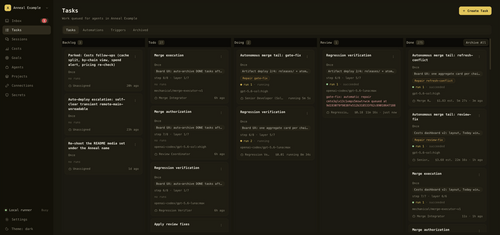

<div align="center">

# Anneal

**AI 现在能写代码了，但没人有能力审完它写的东西。**

Anneal 就是负责审的那一层：面向 coding agent 的本地控制平面。你只写规格，
剩下的交给一条链——计划、评审、实现、验证、合入，每一次 run 都可观察、可评审。

*退火是消除金属加工后内应力的热处理工序。缺陷在工序里被消掉，而不是留到成品上。*

[](#支持状态)
[](LICENSE)
[](#支持状态)
[](.nvmrc)

[安装](#快速开始) · [文档](#文档) · [支持状态](#支持状态) · [English](README.md)



</div>

## 这是什么

Anneal 把任务、agent、仓库与文件授权、独立的运行记录、provider 事件流、人工
提问、评审关卡和 git 交付串成一个工作流，全部跑在你自己的机器上。

它编排的是你已经安装并完成认证的官方 Codex CLI、Claude Code 与 Pi：这些 CLI
手里已有的订阅登录，就是它运行所依赖的全部认证。Anneal 自己不提供任何凭据，
也不转售任何订阅，详见[认证与订阅](#认证与订阅)。

## 它改变了什么

Full Assurance 任务链覆盖完整的交付路径：写规格、计划、计划评审、实现、两轮独立
代码评审、应用修复、回归验证、合并就绪判定，直到合并本身；Direct 任务链省略规格与
计划阶段。Agent 步骤带有自己的角色、提示词、模型与推理档位，机械执行的 readiness
与 merge 步骤则没有。输出只流向模板声明的下游消费者，包括让两路并行评审结果共同
进入 fix 步骤。

链一旦启动就自行推进。需要你出面的只有三种时刻：agent 通过 Inbox 向你提问、你
显式设为 gated 的步骤需要人工裁决、或者某次 run 升级（escalate）。其余时间它无人
值守地跑，交付也在其中：推分支、可选地开 PR、并在 merge gate 之后合入。

这改变的是你的瓶颈在哪里。吞吐取决于你注册了多少 runner，而不是你的工时：不同
任务、不同仓库的链同时在飞，你在读评审产出，不在敲实现。

长时程自治还没接线。Goal 能存能编辑，但没有任何东西从 Goal 调度工作，所以链仍然
由你或 webhook 触发启动，而不是由一个常驻目标驱动。见
[支持状态](#支持状态)。

<div align="center">


<sub>Agents：一个角色、一段提示词、一个模型与档位，以及它派往的 runner。</sub>

</div>

## 看板列

看板展示工作在从意图到交付的流程中所处的位置。任务路由约定中的
[Backlog 卡片生命周期](docs/governance/task-routing-v1.md#backlog-card-lifecycle)
定义了卡片的创建、派发与归档；这里仅定义各列的语义。

- **Backlog — 意图。** 尚未实例化、仍在完善、等待决定或被刻意搁置的 brief；
  它尚未进入执行。对于无限期搁置的 HUMAN 卡片，在标题前加 `Parked:`。
- **Todo — 可运行的执行项。** 规格记录已经确定、现在可运行或正在等待激活或
  依赖解锁的已实例化链或步骤。入口边界很明确：未实例化的意图从 Backlog 进入
  看板；已实例化的链及其步骤从 Todo 进入，再流转到后续各列。
- **Doing — 正在执行。** runner 已激活 AGENT 任务，工作正在进行。
- **Review — 等待生命周期决定。** AGENT 任务因 approval 或 review gate 暂停，
  或出现需要先处理的 run 问题，链才能继续。
- **Done — 已完成。** 任务或链步骤已经完成。

operator 可以停止并搁置正在运行的链步骤；该步骤会以已搁置步骤的形式回到
Backlog。请用 **Start now** 或 **Recover parked step** 恢复它，而不是用普通卡片
派发流程。

Backlog 与 Todo 的状态流转以及将 HUMAN 任务标记为 Done 由 operator 负责；
AGENT 任务的 Doing、Review 与 Done 状态流转由 runner 和链调度器负责。通常，
operator 将已定稿的意图从 Backlog 移到 Todo，随后 runner 推动每个已实例化步骤
依次经过 Doing、Review 与 Done。

## 它由自己的链构建

本仓库的 pull request，其规格、计划、评审、实现与合入，都由下面这条链在一台
Mac 上完成。第一个预览版到第三个预览版之间的八天，从里面看就是这个样子。

链交付的 commit 在 git 历史里还没有明确的归属标记，所以这句话说的是工作方式，
不是一个你现在就能核对的数字。把它变成可核对的，是下一个预览版的任务。

## 十二步任务链

Anneal 自带的 Full Assurance 模板。每一步绑定一个角色，每个角色自带 runner、
模型与推理档位。

下表里的 `Sol` 与 `Luna` 不是 Anneal 造的词，是 Codex CLI 暴露的 GPT-5.6 变体，
绑定名为 `gpt-5.6-sol` 与 `gpt-5.6-luna`。

<details>
<summary><b>十二步完整表</b> —— 每一步的角色、runner、模型与档位</summary>

| # | 步骤 | Agent 角色 | 做什么 | Runner | 模型 · 档位 |
| --- | --- | --- | --- | --- | --- |
| 1 | 写规格 | `spec` | 把任务转成作准的规格说明 | Claude | Claude Opus 5 · high |
| 2 | 规划 | `plan` | 把规格切成可并行的垂直曳光弹切片 | Claude | Claude Fable 5 · medium |
| 3 | 规划评审 | `review-coordinator` | 对着规格与冻结基线逐片评审 | Pi | GPT-5.6 Sol · xhigh |
| 4 | 修订规划 | `plan-reviser` | 在全新会话里按评审结论就地改切片 | Codex | GPT-5.6 Sol · high |
| 5 | 实现 | `implementation-plan-executioner` | 从活的依赖前沿执行切片集，并开出 PR | Codex | GPT-5.6 Sol · high，子代理为 GPT-5.6 Luna · max |
| 6 | 代码评审 | `review-coordinator-sol` | 在钉死的 base 与 head 上评审集成后的 diff | Pi | GPT-5.6 Sol · xhigh |
| 7 | 盲评 | `review-coordinator-opus` | 对同一份 diff 再评一次，看不到第 6 步的结论 | Claude | Claude Opus 5 · high |
| 8 | 应用评审修复 | `senior-dev` | 对两份评审的每条结论逐条裁决，并落实采纳项 | Codex | GPT-5.6 Sol · high |
| 9 | 文档 | `librarian` | 把内部文档更新到与交付代码一致 | Pi | GPT-5.6 Luna · xhigh |
| 10 | 回归验证 | `regression-verifier` | 刷新到目标分支并重跑回归 | Codex | GPT-5.6 Luna · max |
| 11 | 合并就绪 | — | 重算 head，要求每份未结评审清空，签发精确 head 的合并授权 | — | 机械步，不跑模型 |
| 12 | 执行合并 | `merge-integrator` | 对着线上 PR 重新校验每一项前置条件，然后合并 | — | 机械步，不跑模型 |

</details>

<div align="center">


<sub>运行中的一条链：第 4 步执行中，第 6、7 步作为并行同层等待。</sub>

</div>

第 6、7 步是并行同层：盲评看不到对方的输出，由第 8 步一并裁决。第 5 步的根会话
派发原生子代理，档位钉死在 Luna max，最多八个并发。

角色绑定在
[`agents/templates/compound-engineer-workflow/`](agents/templates/compound-engineer-workflow)，
模型在 [`agents/roles/`](agents/roles)。在控制台改过的模型或档位是持久化的运行时
覆盖，后续 seed 不会替换它。

> **Developer Preview 4（v0.4.0）。** 接口、配置与已存数据的形状都可能在预览版
> 之间变动，预览版之间除全新安装外没有升级路径。
>
> **裸机执行警告。** Anneal 会用非交互式 permission bypass 启动 coding CLI。
> 默认安装下它们以你的 macOS 用户身份、在 sandbox 之外运行，拥有该用户的文件
> 系统与网络权限。Anneal grant 约束的是 Anneal API，不构成 host containment。
> 只用可丢弃仓库，以及你愿意让 agent 修改的机器。

## 快速开始

你需要一台 Apple Silicon Mac，以及 `.nvmrc` 记录的 Node.js `22.17.0`（安装强制要求
Node.js 满足 `^20.19.0 || ^22.13.0 || >=24`，其余版本会被拒绝）、npm 10.9.2+、Docker Compose、
Git，以及在同一 macOS 账号下**已安装且已登录**的官方 Codex CLI。Claude Code 与
Pi 都是可选的。

```sh
git clone https://github.com/mosonlab/anneal.git
cd anneal
git checkout v0.4.0
npm ci
npm run setup:local
npm run build
docker compose up -d --wait --wait-timeout 60 postgres
npm run db:migrate:release -- --fresh
```

随后在三个终端里依次启动 `npm run dev:api`、`npm run dev:runner`、
`npm run dev:web`，并打开 `http://127.0.0.1:5173`。

以上是简写形式。包含文件系统、端口、runner identity 与仓库 preflight 的逐字序列
在 [`docs/release/developer-preview.md`](docs/release/developer-preview.md)，
其余安装细节在英文页面 [`docs/install.md`](docs/install.md)。除本页外，内部文档仅
提供英文版。

## 支持状态

Developer Preview。支持范围以及每一条主张背后的证据，记录在
[`docs/release/support-matrix.md`](docs/release/support-matrix.md)，那是权威支持
声明（仅英文）。它描述的是本仓库内记录的证据，不是 CLI provider 作出的兼容性
承诺。

Anneal 的目标平台是 Apple Silicon 上的 macOS。Linux 未验证；Windows 按设计不
支持：runner 依赖 POSIX 进程组、路径和命令行为。

Provider CLI、账号、认证、订阅、用量、速率限制、模型和 provider 侧可用性均由你
自己负责。Anneal 不提供 provider 凭据，也不提供使用资格。

## 认证与订阅

Anneal 不持有任何 provider 凭据。它启动的是你本机已经安装并登录的官方 CLI
（Codex CLI、Claude Code 与 Pi），认证状态留在各个 CLI 自己的配置里，Anneal
既不读取也不转发。这里没有 Anneal 账号，没有 API 反代，也没有要你粘贴的 key。

因此这些 CLI 支持哪种认证，Anneal 就跑在哪种之上：ChatGPT 订阅登录、Claude
Pro/Max 登录，或各 CLI 自己的 API key 模式，完全按你已经配好的样子。Pi 同样没有
自己的账号，它走的是 Codex 那份登录。

这一点你可以自己核实。runner 是为 provider 子进程构造环境，而不是整份复制
宿主环境（[`docs/architecture.md`](docs/architecture.md)、
`packages/runner/src/adapters/`）；发布检查会扫描这份 checkout 里的 token 变量、
bearer header 与 `Authorization`（[`docs/release/security.md`](docs/release/security.md)）。

这些都不能替你裁定 provider 的条款。套餐额度、速率限制、用量配额，以及你的套餐是否
允许这种编排方式，都在你和 provider 之间。Anneal 不授予任何权益，也不替 CLI
provider 作出兼容性承诺。

## 文档

除本页外，内部文档仅提供英文版。

- [架构与安全模型](docs/architecture.md)：控制台、API、runner 与 provider
  CLI 如何拼在一起，以及 grant 约束了什么、没约束什么。
- [安装细节与验证](docs/install.md)：环境文件、迁移、merge executor 与检查序列。
- [安全](docs/release/security.md)：在把它指向任何你在乎的东西之前先读。
- [迁移与恢复](docs/release/migration-and-recovery.md)：在往里放数据之前先读。
- [发布说明](docs/release/v0.4.0-release-notes.md) · [贡献](CONTRIBUTING.md)

## 支持

Anneal 是个人项目，不承诺提供支持或响应时间。安全报告请通过
[`SECURITY.md`](SECURITY.md) 中的私密渠道提交；权威支持声明见
[`docs/release/support-matrix.md`](docs/release/support-matrix.md)。

## 致谢与许可证

任务链的角色与步骤提示词欠的不止是启发：其行文主体来自
[mattpocock/skills](https://github.com/mattpocock/skills) 的五个技能，逐字沿用，
外面包着为本平台契约另写的段落。上游以 MIT 授权，`Copyright (c) 2026 Matt
Pocock`，声明在 [`THIRD_PARTY_NOTICES.md`](THIRD_PARTY_NOTICES.md)。

本快照以 [MIT License](LICENSE) 授权；快照边界由
[`public-snapshot.json`](public-snapshot.json) 定义。
