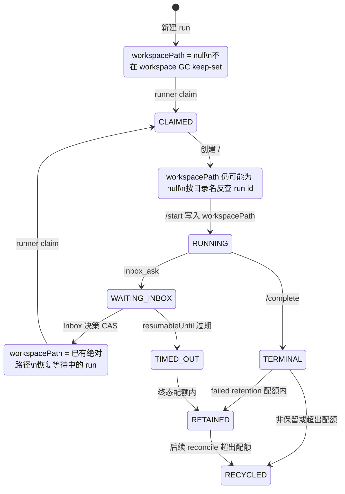

# 平台修缮：工作区、重试与 agent 归档（运行期知识）

这页是给值班者的运行期说明：它描述当前代码如何管理工作区、Inbox 挂起、操作员重试和 archived agent。合并顺序与冲突处理见 [`docs/merge-notes/batch-repairs-and-batch-2.md`](../merge-notes/batch-repairs-and-batch-2.md)；那份是合并操作手册，本页不重复它。

## 先看结论

- `workspacePath` 在 `/runner/runs/:runId/start` 之前可能是 `null`。clone 已经开始但数据库尚未写路径时，GC 通过工作区目录名反查 run id，保护 `CLAIMED`/`PROVISIONING` 的目录。
- 工作区 GC 的活跃 keep-set 是 `CLAIMED`、`PROVISIONING`、`RUNNING`、`WAITING_INBOX`，以及带已存在工作区的 `QUEUED`。`WAITING_INBOX` 和恢复中的 `QUEUED` 不占失败现场配额。
- 失败现场配额只从 `workspaceRetained=true` 且处于终态的 run 中计算；`endedAt=null` 的终态现场按最新处理，避免最不完整的失败写入反而先被删。
- `inbox_ask` 默认给挂起 run 七天的恢复窗口；显式传 `null` 是永不过期。过期后由 reconcile CAS 成 `TIMED_OUT`，任务进入 `REVIEW`，工作区才进入终态配额管理。
- 操作员点 retry 会从当前 agent 重算 runner、model、promptHash；自动重试和 lease-loss requeue 仍复制原 run 的冻结执行配置。
- `promptHash` 只覆盖四段提示词文本，不是 runner/model 配置版本号。runner/model 改变而四段文本不变时，hash 必须仍然相同。

## 工作区完整生命周期

工作区目录名是 run id，路径由 runner 的 `RUNNER_WORKSPACE_ROOT` 加 run id 得到：
`resolve(workspaceRoot, run.id)`。数据库中的 `workspacePath` 是 runner 在 `/start` 请求中提交的路径；它不是 clone 开始的信号。



| 阶段 | Run 的 `workspacePath` | `reconcileWorkspaces` 如何识别/处理 |
| --- | --- | --- |
| 新建 `QUEUED` | `null`，没有对应工作区 | `QUEUED` 虽在 keep-set，但没有目录就没有东西可保留；新建 run 不会凭空扩张 GC 范围。 |
| Inbox 已回答、等待恢复的 `QUEUED` | 仍是原来的绝对路径 | 通过 `workspacePath` 的 `byPath` 匹配；`QUEUED` 在 keep-set，保留目录。 |
| `CLAIMED`，准备 clone | 新 run 通常仍为 `null`；恢复 run 已有路径 | 活跃 run 被 claim，但 clone 窗口的目录可能尚未出现在 `byPath`。目录名等于 run id 时由 `byId` 识别并保留。 |
| clone / provision 窗口 | 目录已存在，`workspacePath` 仍可能为 `null`；当前 claim 会把 Session 置为 `PROVISIONING`，Run 的保护逻辑同时覆盖 `CLAIMED` 与 `PROVISIONING` | 查询同时取“非空 `workspacePath` 的 run”和“id 命中当前目录名的 run”；活跃 keep-set 覆盖这两个状态。 |
| `RUNNING`（`/start` 成功） | `/start` 写入实际路径，通常为 `<root>/<runId>`；同时写 branch/baseSha | `byPath` 和 `byId` 都可识别；保留。 |
| `WAITING_INBOX` | 保留原路径；`inbox_ask` 还会置 `workspaceRetained=true`，并释放 lease | 仍在活跃 keep-set；不进入终态 retention pool。数据库 run reconcile 的 orphan 查询仍只查 `CLAIMED`/`PROVISIONING`/`RUNNING`，不会把无 lease 的等待 run 标成 `LOST`。 |
| `TIMED_OUT` / 其他终态 | 成功启动过的 run 通常仍留着路径；clone 或 preflight 失败可能仍为 `null` | 不再进活跃 keep-set。只有 `workspaceRetained=true` 且目录可按路径或 run id 对上的终态现场，才参加 retention quota。 |

成功或未获保留资格的目录会被删除；删除后对应 run 的 `workspaceRetained` 被清为 `false`，session cleanup 标为已完成。没有匹配数据库 run 的目录也会删除。删除使用强制递归方式，`readdir` 后若 runner 先一步删掉目录，GC 不会因 TOCTOU 的 `ENOENT` 失败。

### clone 窗口为什么必须单独记住

runner 的顺序是：claim → 在 `<root>/<runId>` 创建目录并 clone → 调用 `/runner/runs/:runId/start`。因此 claim 到 `/start` 之间，目录已经能被另一个 run 完成触发的 reconcile 看见，但 `workspacePath` 还没有写入数据库。仅按非空 `workspacePath` 查询会漏掉它；现在查询按目录名带回活跃 run id，再按状态决定保留。

这也是 `byPath` 与 `byId` 两张表的意义：`byPath` 处理已持久化的绝对路径，`byId` 处理 clone 窗口以及 preflight 失败时 `workspacePath=null` 的目录。

## GC / reconcile 的保留与删除规则

`reconcileWorkspaces(db, workspaceRoot, failedRetentionCount)` 的决策顺序如下：

1. 扫描 root 下的目录；root 不存在时本轮返回 0。
2. 数据库查询取 `workspacePath != null` 的 run，外加 id 等于当前目录名的 run。
3. 目录匹配到任一活跃状态就保留：`CLAIMED`、`PROVISIONING`、`RUNNING`、`WAITING_INBOX`、`QUEUED`。
4. 其余目录只有在匹配到 retention pool 中的 run 时保留；其他目录删除。

retention pool 的条件是：

```text
workspaceRetained = true
AND status IN (SUCCEEDED, FAILED, TIMED_OUT, CANCELLED, LOST)
AND 目录按 workspacePath 或目录名能匹配到该 run
```

`RUNNER_FAILED_WORKSPACE_RETENTION`（runner 默认值为 `2`）就是这个池的容量。代码将 pool 排序后取 `slice(0, max(0, failedRetentionCount))`：

- `endedAt=null` 排在所有有日期的终态之前；两个都为 `null` 时以 run id 稳定排序。
- 有日期时按 `endedAt` 从新到旧。

`endedAt=null` 在终态现场意味着失败/清理写入可能只完成了一部分；它是最需要保留供诊断的现场，不能因为缺时间戳就被当成最旧。活跃 run 不参加这个池，因此 `WAITING_INBOX` 不会抢失败现场的名额；已保留的终态 run 也不会因“不在活跃 keep-set”而从 quota 统计中消失。

## 四个故障：症状 → 根因 → 现在靠什么守着

### 1. clone 窗口裸奔

**症状。** 运行日志或 failureReason 中能直接搜到：

```text
could not lock config file … No such file or directory
git failed (128)
```

这通常发生在 clone 正在写 `<root>/<runId>/.git/config` 时，另一个 run 完成触发 GC，把尚未写入 `workspacePath` 的目录删了。

**根因。** 旧查询只看非空 `workspacePath`。claim 到 `/start` 的时间窗里，run 已经是活跃的，但数据库没有路径；路径型 `byPath` 无法把目录和 run 连起来。

**现在靠什么守着。** reconcile 先读目录名，再把 `id IN (目录名)` 与非空路径条件一起查库；对 `CLAIMED`/`PROVISIONING`/`RUNNING` 的目录按状态保留。即使 preflight 在 `/start` 前失败、终态 run 的 `workspacePath` 仍为 `null`，目录名也能让 retention pool 正确识别它。

### 2. `WAITING_INBOX` 工作区被清

**症状。** 人工回答后 resume 失败，日志/failureReason 通常包含：

```text
ENOENT: no such file or directory, stat '/tmp/agentos-runs/<runId>'
```

值班时也会看到 run 已从 `WAITING_INBOX` 回到 `QUEUED`，但 runner 的 `reuseWorkspace` 找不到已保存的目录。

**根因。** 等待 run 没有 lease，旧 workspace GC 只把 `CLAIMED`/`PROVISIONING`/`RUNNING` 当活跃；而 `endedAt=null` 的等待 run 还可能在失败现场排序中垫底，被 retention quota 淘汰。回答后 `WAITING_INBOX → QUEUED` 的窗口同样会丢工作区。

**现在靠什么守着。** `WAITING_INBOX` 和带工作区的 `QUEUED` 都在 workspace keep-set；等待 run 不再进入终态 retention pool。`workspaceRetained=true` 继续表达“工作区要留下”，但不再承担活跃保活的唯一职责。

### 3. 多进程工作区根不一致

**症状。** 进程间 `RUNNER_WORKSPACE_ROOT` 不同，常见可 grep 的 runner 错误是：

```text
Resumed workspace escaped the controlled root
ENOENT: no such file or directory, stat '<另一套 workspace root>/<runId>'
```

另一种表现是活跃工作树整片消失：API 的 reconcile 扫描了某个进程认为是 workspace root 的目录，而 runner 正在使用另一套 root；恢复时找不到原目录，或者错误的 GC 清掉了仍在使用的树。2026-08-16 上午的混编实战中，runner-5/6 使用新根、其余 runner 使用旧根，同一评审任务在 runner-5 连挂三次；统一回旧根后立即恢复正常。

**根因。** workspace root 是进程配置，不是从 run row 动态协商的共享租约。runner 的 clone/reuse/cleanup 和 API 的 startup/post-completion reconcile 只相信各自的 root；不同进程看到的目录集合不一致。

**现在靠什么守着。** `provisionWorkspace`、`reuseWorkspace`、`cleanupWorkspace` 和 API reconcile 都解析并校验各自的 root；clone 窗口的 run-id 反查解决“路径尚未落库”。API 还必须在导入 Prisma、reconcile 或 listen 前取得 canonical root 的主机级独占所有权；同一数据库、复制/不同数据库都不能绕过。runner 不取得该锁，多个 runner 仍可连接同一 owning API。受保护状态、拒绝/恢复判据和非激活回滚见英文运维手册 [`control-plane-workspace-ownership.md`](../runbooks/control-plane-workspace-ownership.md)。部署仍必须统一 API/runner root，迁移期间按下面的滚动规则操作。

### 4. retention quota 把应该留下的终态现场排除

**症状。** 失败现场在 reconcile 后消失；可观测到 run 仍是 `FAILED`/`TIMED_OUT`/`LOST`，但数据库变成 `workspaceRetained=false`，session cleanup 变成 `SUCCEEDED`，并伴随启动日志中的 `workspaces cleaned` 增加。此时原本应该用于复盘的 git 工作树已经不在 root 中。

**根因。** 旧 retention pool 只从路径匹配结果中构建，且把“已保留”现场错误地排除在后续池计算之外；`workspacePath=null` 的 preflight 失败现场也因此无法占用有余量的名额。另一个危险是把 `endedAt=null` 排到最后，最不完整的失败现场最先被驱逐。

**现在靠什么守着。** retention pool 直接从“目录按路径或 run id 匹配、`workspaceRetained=true`、状态为终态”的 rows 构建；接受 `workspacePath=null`，并把 `endedAt=null` 排在最前。活跃状态单独判定，不会占用 `RUNNER_FAILED_WORKSPACE_RETENTION` 的终态容量。

## `WAITING_INBOX` 的新生命周期

`inbox_ask` 的 `resumableUntil` 有三种语义：

- 省略：以 suspend 时刻为基准，默认 `7 days`。
- 显式日期：使用调用者给出的截止时间。
- 显式 `null`：永不过期；这是有意的无限期挂起，不是“未设置”。

正常回答路径使用 CAS：OPEN 问题变为 ANSWERED，回复消息关闭，run 从 `WAITING_INBOX` 变为 `QUEUED`，`readyAt` 更新，session 回到 `REQUESTED`，回答写入 `resumeInput` 并递增 `resumeAttempt`。原 `workspacePath` 不变，直到 runner 再次 claim 并通过 controlled-root 检查复用它。

reconcile 在每次数据库 reconcile 中查找 `status=WAITING_INBOX` 且 `session.resumableUntil < now` 的 run。过期处理在事务中逐个 CAS：只有仍为 `WAITING_INBOX` 的 run 才会被改为 `TIMED_OUT`，写入 `endedAt`、`retryable=false`、`CANCELLED_OR_TIMED_OUT` 和 `Inbox response window expired`。CAS 成功后还会：

- 将 session 置为 `TIMED_OUT`、`cleanupStatus=RETAINED`，写结束时间；
- 关闭仍 OPEN 的问题消息；
- 将关联 task 置为 `REVIEW`，写同样的 failureReason，并追加 `Inbox response window expired; run moved to review` activity。

此后工作区不再属于活跃 keep-set，而是按终态 retention quota 管理。显式 `resumableUntil=null` 的 run 不匹配过期查询，因此不会被这条规则自动终止。

### 这对 `inbox_ask` 禁令意味着什么

合并本批次并重启平台后，挂起的工作区有活跃 keep-set 保护，且不会再被无差别 workspace GC 删除；默认七天还给“永远挂住”的工作区提供了可回收终点。技术前置条件已满足，Leo 可以据此决定是否解除当前对 agent 调用 `inbox_ask` 的禁令。本文不解除禁令，也不替 Leo 做这个决定。

## Agent archive 的运行期行为

`Agent.archivedAt=null` 表示可派发；非空表示 archived/soft-offline。归档不删除历史，也不取消已经在 `CLAIMED`、`RUNNING` 或 `WAITING_INBOX` 的 run；这些 run 可以完成。它影响的是新的派发：

- 新建 task、修改 task assignee、模板实例化会拒绝 archived agent；
- 操作员 retry 返回 409，并要求先 unarchive；
- runner claim 查询直接带 `agent.archivedAt=null`，所以 archived 的 `QUEUED` run 不占候选窗口、不被 claim；
- chain successor 如果在前一步成功时发现 agent archived，会把 successor 停在 `REVIEW` 并写 failure/activity，让前一步的成功、session close 和 output 仍然提交；
- approval gate 的 approve/reject 如果需要给 archived agent enqueue，会返回可重试的错误，决策事务回滚，Inbox 问题保持可处理。

归档后的 `QUEUED` run 不会静默消失。归档端点会立即扫描一次；API 启动也立即扫描；claim 轮询使用每个 `createApp` 实例自己的 60 秒调度器。每个 run 的 notice id 包含 run id 和本次 `archivedAt`，因此并发扫描只产生一条 activity，重新归档后又会产生新的周期 notice。notice 的正文形如：

```text
Assignee <name> is archived; run <n> stays queued and is not claimed until the agent is unarchived
```

unarchive 不需要搬运或重建 run；它只让原来被跳过的 `QUEUED` run 在下一次 claim poll 中重新可见。读取 agent、task、run、session、Inbox history 的接口仍然返回这些历史。若对有历史的 agent 直接 DELETE，数据库 FK 错误映射为 409：`Agent has task history; archive it instead`；archive 不是硬删除许可。

## 运维与部署注意事项

### 工作区根迁移

Files 的部署结论是：采纳 `defaultWorkspaceRoot` 时，滚动期必须继续保留 `/tmp/agentos-runs`，或者先排空/迁移所有已保留终态工作区和 `WAITING_INBOX` 工作区，再切换所有 API/runner 进程。否则新旧进程会看到两套目录，等同于人为制造“多进程 workspace root 不一致”故障。

迁移检查至少要确认：

1. 所有 API 实例的 `RUNNER_WORKSPACE_ROOT` 一致；
2. 所有 runner 实例与 API 使用同一 root；
3. `workspacePath` 已保存的 retained/WAITING_INBOX run 在切换后仍位于 runner 的 controlled root 内；
4. 没有旧实例会继续启动 reconcile 并清理另一套 root。

此外，唯一 API 必须使用独立的 `CONTROL_PLANE_STATE_DIR`。该目录必须位于源码允许的本地文件系统上，由 API uid 以 `0700` 独占，且 runner/model uid 无法读写；仅写绝对路径不构成文件系统证据。详细 preflight 和禁止在 live root 上排练的边界只看上述英文手册。

### archived-run 审计扫描的节流边界

`noteArchivedQueuedRuns` 每页最多读 100 个 run，按 id 游标分页；每读完一页就写入该页 activity，不把整个 archived queue 一次性 materialize。它没有新增索引：分页解决单次扫描的无界内存，claim 轮询每 60 秒最多扫一次解决多 runner 重复放大；当前查询仍可利用既有的 run status/readyAt 与 agent id 索引，避免为这条审计路径再引入 migration。

不要把“节流”理解成所有扫描都延迟：

- API 启动时的归档审计立即执行；
- `POST /agents/:agentId/archive` 的目标 agent 审计立即执行；
- 只有 `POST /runner/tasks/claim` 触发的轮询使用每个 `createApp` 实例的 60 秒 coalescing scheduler；并发调用共享一个 in-flight promise。

因此启动和显式归档不会等 60 秒；只有连续 claim poll 被合并。审计失败会记录日志并放行 claim/启动流程，不应把“写 activity 失败”变成派发故障。

### `promptHash` 的边界（显眼提示）

当前 hash 算法是：

```text
sha256(foundationalPrompt + "\n" + rolePrompt + "\n" + task.name + "\n" + task.description)
```

它不包括 runner、model、agent id、runner preference 或其他配置。结果因此是有意的：agent 的 runner/model 变了，只要这四项提示词文本没变，`promptHash` 仍相同。

执行路径的区别必须记住：

- **操作员 `/tasks/:taskId/retry`**：读取当前 assignee agent，按当前配置重新导出 runner/model/promptHash；template step 的显式 runner override 仍优先。
- **自动 retry（completeRun 的 transient retry）和 lease-loss requeue**：复制失败/丢 lease 的原 run 配置，包含原 runner、model、promptHash；这是瞬时故障路径的冻结配置契约。

所以不要用 promptHash 判断 runner/model 是否已经更新，也不要期待自动 retry 因 agent 配置改变而自行切换 runner。若改动必须影响自动路径，应先让任务获得新的执行配置（通常是新建任务，或使用明确的操作员 retry），而不是只比较 hash。

## 后续批次的注意事项

本批次触及 `packages/api/src/reconcile.ts`、`app.ts`、`inbox.ts`、`packages/db/src/workflow.ts` 和 `packages/inbox/src/index.ts`。它与批次 2（PR #2）在 `workflow.ts` 有真实语义冲突；`app.ts` 即使能干净合并，也可能静默绕过本批次的归档防护。合并顺序必须先本批次、再批次 2，具体冲突点和检查表只看 [`batch-repairs-and-batch-2.md`](../merge-notes/batch-repairs-and-batch-2.md)。
