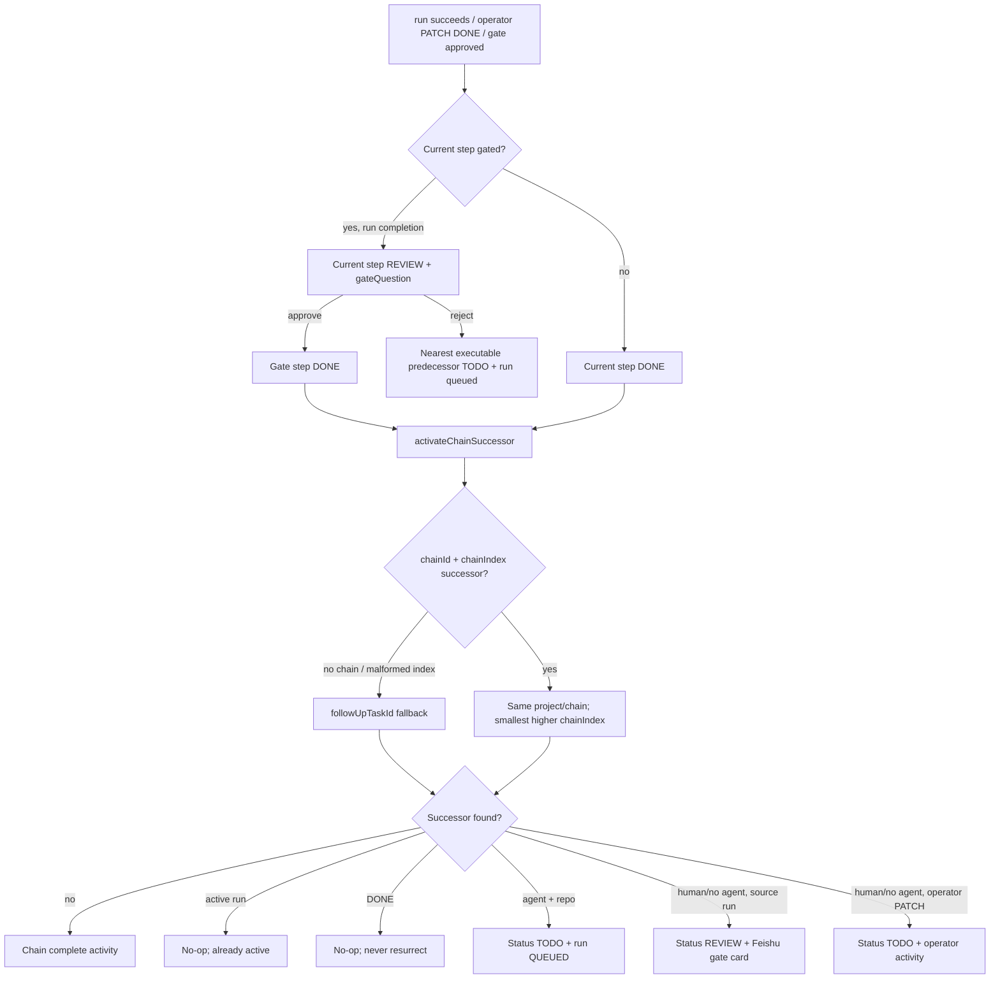

# Batch 2 Tasks Automation Runbook

This page describes the current behavior of task-chain auto-advance, the API
scheduler, and inbound template webhooks. The implementation is concentrated in
`packages/db/src/workflow.ts`, `packages/api/src/app.ts`,
`packages/api/src/scheduler.ts`, and the Task/TaskTemplate schema.

## 1. Chain auto-advance

### What starts an advance

All three entry points converge on `activateChainSuccessor`:

| Entry point | Current-step behavior | Advance behavior |
| --- | --- | --- |
| Successful runner completion | A non-gated chain step becomes `DONE`. A gated chain step becomes `REVIEW` and gets a gate card. Template steps also persist/upsert `TaskStepOutput` before the gate or successor action. | A non-gated step calls `activateChainSuccessor`; a gated step waits for approval. This applies to template and non-template chain/follow-up tasks. |
| `PATCH /tasks/:taskId` with `status=DONE` | Only a real transition from a status other than `DONE` enters the advance transaction. Template approval-gate tasks still return `409`. For a non-template gated task, an open gate card is closed. | The update, activity, gate-card close, and successor activation share one `ReadCommitted` transaction. This operator path has no source run, so it never creates a new gate card for a human successor. |
| Inbox gate approval | The gate task is set to `DONE` and an approval activity is written. | `applyInboxDecisionTx` calls `activateChainSuccessor` with the gate run and chat context. |

Gate rejection does not advance forward. It requeues the gate task when it is
agent-executable. For a human gate, the implementation first uses the direct
`previousTask` relation when present; when that relation is absent, it finds the
nearest lower `chainIndex` in the same project/chain that has an agent and repo,
requeues that predecessor, and queues its run again. This chain-ordered fallback
is the repair for HUMAN gates assembled without a usable predecessor relation.

### Successor selection

1. If both `chainId` and `chainIndex` are present, find a task in the same
   project and chain whose `chainIndex` is greater than the current index. Pick
   the smallest such index. Missing indexes do not stall the chain.
2. If `chainId` is present but `chainIndex` is null, write a diagnostic activity
   (`Chain row missing chainIndex; auto-advance skipped`) and fall back to
   `followUpTaskId`.
3. If there is no chain, use `followUpTaskId` as the legacy successor link.
4. If no successor is found for a real chain, write `Chain complete` and stop.

The successor is first read with its latest run and `updatedAt`. If it already
has a run in `QUEUED`, `CLAIMED`, `PROVISIONING`, `RUNNING`, or
`WAITING_INBOX`, the call records an already-active activity and does not enqueue
another run.

Otherwise the caller claims it with this compare-and-set shape:

```text
where: id = successor.id
       updatedAt = the value observed by this transaction
       status in {TODO, DOING, REVIEW}
data:  status = TODO
```

`updatedAt` is the token. Any operator edit or competing advance changes it and
invalidates the token. A lost claim is re-read: an active run is treated as
already advanced, `DONE` is terminal and is never resurrected, and another
non-terminal state is retried with its new `updatedAt`. A residual unique
conflict while creating the run is contained inside the routine (with a
savepoint where available) and is treated as already advanced rather than
surfacing as an API error.

An agent successor with both an agent and repo gets a queued run and a
`Predecessor ... completed; step queued` activity. A human successor, or a row
without an executable agent/repo, follows two distinct paths:

- With a successful source run: set the successor to `REVIEW`, create a Feishu
  approval card through `gateQuestion`, and include the persisted output preview
  when available. `FEISHU_DEFAULT_CHAT_ID` supplies the Feishu thread context;
  without it the Inbox message still records the gate but has no external chat
  thread. The card is deduplicated by
  `gate:task:<taskId>:run:<sourceRunId>`.
- From operator `PATCH ... status=DONE`: leave the successor `TODO`, write
  `Predecessor completed; successor awaits operator`, and send no card because
  there is no run/session to attach to.

Two simultaneous advancers therefore do not mean two successor runs. One wins
the `updatedAt` claim; the other observes either the active run, a completed
successor, or a changed row and exits/retries accordingly. An unrelated write
does not permanently strand the chain, and a repeated `DONE` cannot revive a
completed successor.



## 2. Scheduler operations

The API process starts one non-overlapping scheduler interval after the HTTP
server starts. `SCHEDULER_POLL_INTERVAL_MS` defaults to `30000`. The value must
be a non-negative, safe integer represented only by decimal digits. `0` is an
explicit process-wide kill switch; suffixes such as `1000ms`, negative values,
fractions, and unsafe/overflowing integers warn and fall back to `30000ms`.

### Creating and pausing schedules

- `NOW` keeps the normal create-time behavior and queues an agent task
  immediately.
- `AT` requires `runAt`, an agent assignee, and a repo. Creation does not queue
  immediately. Once `runAt <= now`, the scheduler queues run 1 on the task and
  leaves `runAt` unchanged. The due query also requires `TODO`, no existing run,
  and an agent assignee, so a task fires once.
- `CRON` requires a standard five-field expression and accepts an optional valid
  IANA `timezone`. The server computes the next `runAt`; a caller-supplied
  `runAt` is ignored for CRON. Macros and six-field expressions are rejected.
  The recurring definition stays `TODO`; each fire creates an independent
  one-shot `NOW` copy, clears schedule/chain/template fields on the copy, adds a
  fire-time suffix to its name, and queues its run when it has an agent and repo.
  Human copies remain `TODO` without a run. Both the definition and copy receive
  an activity with `recurringTaskId` and `firedAt` metadata.

To pause a recurring definition, patch it to a non-`TODO` status (for example
`DONE`); the poll only selects `status=TODO`. Patch it back to `TODO` to resume
when due. `SCHEDULER_POLL_INTERVAL_MS=0` disables all CRON/AT polling without
changing API routes. Patching schedule fields recomputes/validates the merged
schedule; status-only updates do not reparse an untouched corrupt cron value.

A concurrent CRON tick claims the definition by changing `runAt` while matching
the observed `id`, `scheduleKind`, `status`, and `runAt`. Only the winner makes
the copy. Missed CRON occurrences coalesce into one catch-up fire, after which
`runAt` is strictly in the future. Overlapping copies are allowed. Concurrent
AT ticks rely on the no-run query plus the run uniqueness constraints; a losing
`P2002` is treated as already fired.

### Required configuration and observability

At minimum the API needs its normal `DATABASE_URL`; the scheduler-specific
environment setting is optional because it has a default. Task-level required
values are `runAt` for AT and `cron` (plus optional IANA `timezone`) for CRON.
The API rejects AT without an agent and repo. `FEISHU_DEFAULT_CHAT_ID` is needed
when a source run must create a Feishu gate thread; it is not needed for an
ordinary scheduled fire.

Inspect `status`, `runAt`, latest runs, and task activity through the task API.
The scheduler logs a `Scheduler tick` only when it fired or quarantined work.
Malformed stored CRON rows are quarantined by clearing `runAt`, writing one
`Schedule quarantined: ...` activity, incrementing the quarantine count, and
emitting a warning. A transient fire or database error is logged with the task
id and remains due for a later tick; it is not permanently quarantined. A bad
interval setting emits an explicit warning with the fallback value.

For schema verification, run `npm run db:drift-check` with `DATABASE_URL`
pointing at the migrated schema. Real DB tests use a dedicated non-public
schema and reset/replay every migration before the process's suite.

## 3. Webhook trigger operations

Webhooks are configured on `TaskTemplate`, not on the removed Trigger model.
Patch `/task-templates/:templateId` with:

- `webhookSecretId`: a Secret with purpose `WEBHOOK`; it must not be disabled.
- `webhookRepoId`: a Repo in the template's project. A non-null webhook secret
  requires this repo.
- `webhookPayloadMapping`: optional `{ map, defaults }`. Each template variable
  must resolve from a mapped dot path to a scalar, or from a scalar default.
  Empty strings are valid values. Objects and arrays are unresolved.

The exact public endpoint is `POST /hooks/templates/:templateId` with the
`X-AgentOS-Webhook-Secret` header and a JSON object body no larger than 1 MiB.
The header is compared in constant time against the decrypted stored secret.
Success returns `201 { chainId, taskIds }`, instantiates the template chain, and
records `actorType=webhook` plus `webhookTemplateId`/`firedAt` activity metadata.
The response never includes the secret or ciphertext; template reads expose only
the configuration identifiers and mapping.

Set `webhookSecretId` to `null` to disable a template, or disable the Secret;
both make the public route return `401`. Wrong, missing, disabled, unknown, and
unconfigured templates intentionally return the same `401` shape and create no
rows. Invalid JSON/object shape is `400`; an unresolved variable list is `400`;
an over-limit body is `413`.

Replay handling is deliberately absent: there is no replay window, timestamp
tolerance, idempotency key, or duplicate-fire dedupe in this version. Every
authenticated repeat creates a separate chain; the caller must provide replay
protection if it needs it. Under concurrent
instantiation, the server retries `P2034`/`P2002` transaction conflicts up to
five attempts with jitter and a fresh chain id per attempt. Exhausted `P2034`
contention is mapped to `503` so the caller can retry; any other residual
database error follows the normal API error handler. The created tasks and
activities are the durable fire trail; `chainId` and
`taskIds` from the response should be retained by the caller for correlation.

## 4. Fixed failure signatures (A/B/C/D)

These are operational fingerprints. When the symptom appears, use the stated
root cause and current guard before changing behavior.

### A — boundary and harness defects

**A1 — DONE successor resurrection**

- **Symptom:** a repeated operator `DONE` or duplicate completion creates a new
  run for a successor that was already `DONE`.
- **Root cause:** advance was entered for an already-DONE source, and the
  successor claim reset any status to `TODO`, including `DONE`.
- **Now guarded by:** only a real transition into `DONE` advances; the claim
  status predicate admits only `TODO`/`DOING`/`REVIEW`, and completion status
  writes use an expected-status CAS.

**A2 — HUMAN-gate rejection cannot find its predecessor**

- **Symptom:** rejecting a gate on a human successor fails with “no executable
  previous task” even though an earlier chain step can run.
- **Root cause:** the direct `previousTask` relation can be absent for a
  chain-ordered HUMAN gate; the old path had no chain-order fallback.
- **Now guarded by:** when that relation is absent, rejection searches the same
  project and `chainId` for the nearest lower `chainIndex` whose assignee and
  repo are executable, then requeues and enqueues that row.

**A3 — scheduler interval parses garbage**

- **Symptom:** values such as `1000ms`, `-1`, fractional text, or a huge number
  are partially accepted, disable the loop unexpectedly, or produce an invalid
  timer.
- **Root cause:** permissive integer parsing accepted prefixes and did not
  enforce safe non-negative values.
- **Now guarded by:** `Number()` plus lexical digits validation and
  `Number.isSafeInteger`; exact `0` disables, all invalid values warn and use
  `30000ms`.

**A4 — DB tests miss migrations**

- **Symptom:** migration tests pass against a previously prepared schema while
  a fresh install or a later migration fails.
- **Root cause:** the test process deployed onto a reused schema instead of
  replaying the complete migration history from empty.
- **Now guarded by:** each DB-test process requires a dedicated non-public schema
  and runs `prisma migrate reset --force --skip-seed`, replaying every migration.

### B — concurrency and API-edge defects

**B1 — unrelated successor write breaks the chain**

- **Symptom:** an advancer reports no error, but the successor has no queued run
  after an operator edit races the advance.
- **Root cause:** an `updatedAt` CAS miss was assumed to mean another advancer
  had won, so the caller returned without re-reading the row.
- **Now guarded by:** a CAS miss re-reads: active run means no-op, `DONE` means
  no resurrection, and any other non-terminal row retries with its new token.

**B2 — follow-up-only completion stops**

- **Symptom:** a non-template task with `followUpTaskId` completes successfully
  but its successor remains unqueued.
- **Root cause:** the completion route only entered chain logic for `chainId`.
- **Now guarded by:** successful completion enters the shared path when either
  `chainId` or `followUpTaskId` is present.

**B3 — empty webhook variable is reported missing**

- **Symptom:** a mapped scalar `""` is treated as an unresolved required
  variable even though the payload contains it.
- **Root cause:** presence was tested with truthiness rather than property
  presence and `undefined`.
- **Now guarded by:** own-property/`undefined` checks; an empty string is a
  supplied value and is persisted through instantiation.

**B4 — `__proto__` mapping behaves like a magic property**

- **Symptom:** a webhook variable named `__proto__` is not retained as ordinary
  data or changes object behavior.
- **Root cause:** resolved variables were accumulated in a normal prototype-
  bearing object.
- **Now guarded by:** the mapping result is a null-prototype dictionary and
  regression coverage checks `__proto__` as an own property.

**B5 — drift command reports a false schema difference**

- **Symptom:** the migration is applied, but drift verification reports broad
  remove/add changes or there is no root command to run.
- **Root cause:** the comparison used the wrong schema namespace or a
  migration-source mode that did not match the live URL.
- **Now guarded by:** `db:drift-check` uses Prisma `migrate diff --from-url`
  with the same `DATABASE_URL` and is exposed at the root/package level.

### C — integration, retry, and observability defects

**C1 — concurrent webhooks fail or lose fires**

- **Symptom:** simultaneous authenticated fires return transaction errors or
  fewer chains than requests.
- **Root cause:** Serializable template instantiation has real contention, and
  every attempt was not isolated with a new chain identity.
- **Now guarded by:** five bounded `P2034`/`P2002` retries with jitter and a fresh
  chain id; exhausted contention is an explicit `503`. Independent requests
  remain independent chains.

**C2 — completion-route behavior is only unit-tested**

- **Symptom:** helper tests pass while a real completion request leaves a
  non-template chain in the wrong status, misses a gate card, or does not queue
  the next task.
- **Root cause:** the endpoint's run lease, status CAS, output, gate, and
  successor effects were not verified together against PostgreSQL.
- **Now guarded by:** real DB completion-route cases assert non-gated and gated
  chain/follow-up outcomes, gate dedupe, and reviewable output.

**C3 — scheduler quarantine count/behavior is misleading**

- **Symptom:** a malformed cron is quarantined but the tick count/log is wrong,
  or a transient DB/fire error permanently removes a still-valid schedule.
- **Root cause:** parse quarantine and transient fire failure shared a path with
  inconsistent counting and permanence.
- **Now guarded by:** winning parse quarantine increments and warns; transient
  errors log and remain due for the next tick.

**C4 — status-only PATCH rejects a corrupt stored cron**

- **Symptom:** disabling or renaming a task with an untouched bad cron returns a
  schedule validation error.
- **Root cause:** PATCH reparsed all stored schedule fields even when no
  schedule or AT executor field changed.
- **Now guarded by:** schedule validation runs only when schedule fields, or AT
  executor fields, are touched.

**C5 — chain race test gives false confidence**

- **Symptom:** a concurrency test sometimes exercises only one claimant and
  still passes.
- **Root cause:** `Promise.all` does not guarantee both transactions reached the
  pre-CAS point before either claim ran.
- **Now guarded by:** two real clients synchronize on an explicit pre-CAS
  barrier, then assert one eventual queued run.

**C6 — AT dedupe test is not actually concurrent**

- **Symptom:** the AT test passes sequentially but does not prove duplicate
  scheduler ticks cannot create two runs.
- **Root cause:** the test lacked a barrier before the competing creates.
- **Now guarded by:** two clients overlap at a pre-create barrier; a subsequent
  sequential tick also verifies a task with an existing run is excluded.

**C7 — non-template gate card has no artifact**

- **Symptom:** a reviewer receives the gate card but must open the Tasks page to
  see the successful output, or the card is empty for a non-template chain.
- **Root cause:** output persistence was limited to the template completion
  branch, while gate rendering reads `TaskStepOutput`.
- **Now guarded by:** successful chain/follow-up completion upserts output before
  `gateQuestion`; the card includes the bounded output preview.

**C8 — migration assertions use the wrong schema**

- **Symptom:** migration DB tests fail with a custom `TEST_DATABASE_URL`, or
  assertions silently inspect `agentos_test` instead of the active namespace.
- **Root cause:** `information_schema` queries hard-coded the default test
  schema.
- **Now guarded by:** the harness parses `testDatabaseSchema` from the actual
  URL and uses it in every information-schema assertion.

**C9 — template listing leaks webhook credentials**

- **Symptom:** a template-list response contains `webhookSecret`, encrypted
  value, or ciphertext fields.
- **Root cause:** the response serialized credential-bearing Prisma data rather
  than the public template configuration.
- **Now guarded by:** API regression coverage asserts no secret/ciphertext value
  is serialized; webhook configuration exposes identifiers/mapping only.

### D — transaction isolation and status races

**D — completion overwrites an operator decision**

- **Symptom:** an operator marks a task `DONE`, but a concurrently finishing run
  later changes it to `REVIEW` (or the reverse), despite the operator action
  having completed first.
- **Root cause:** changing isolation to avoid serialization failures removed the
  protection of unconditional task-status writes.
- **Now guarded by:** `ReadCommitted` is retained for successor-CAS loser
  behavior, while every completion status update includes the status observed
  at read time. The deterministic race test proves operator `DONE` is preserved.

The specification/plan amendment that defines successful-run HUMAN successors
as `REVIEW + gate` is part of the current contract; it is not an optional
template-only behavior.

## 5. Notes for the next batch

This batch's behavior touches:

- `packages/db/src/workflow.ts`: shared successor selection, CAS activation,
  gate approval/rejection, and run completion helpers.
- `packages/api/src/app.ts`: run-success and operator-PATCH triggers, gate
  creation, task/template/webhook routes, and schedule validation.
- `packages/api/src/scheduler.ts`: CRON/AT polling, fire/quarantine CAS, and
  interval parsing.
- `packages/db/prisma/schema.prisma`: webhook configuration on
  `TaskTemplate`, the schedule poll index on `Task`, and removal of the dead
  Trigger/Automation/InboxConnectionWindow models.

The repair batch (PR #6) has a real semantic conflict with this batch in
`workflow.ts`. Merge the repair batch first, then merge this batch. During the
conflict resolution, preserve the repair's archive pre-check by moving that
pre-check down into `activateChainSuccessor`; do not leave it only in a caller
or choose one side's old helper wholesale. Re-run the chain DB race and gate
approval/rejection tests after the merge.
